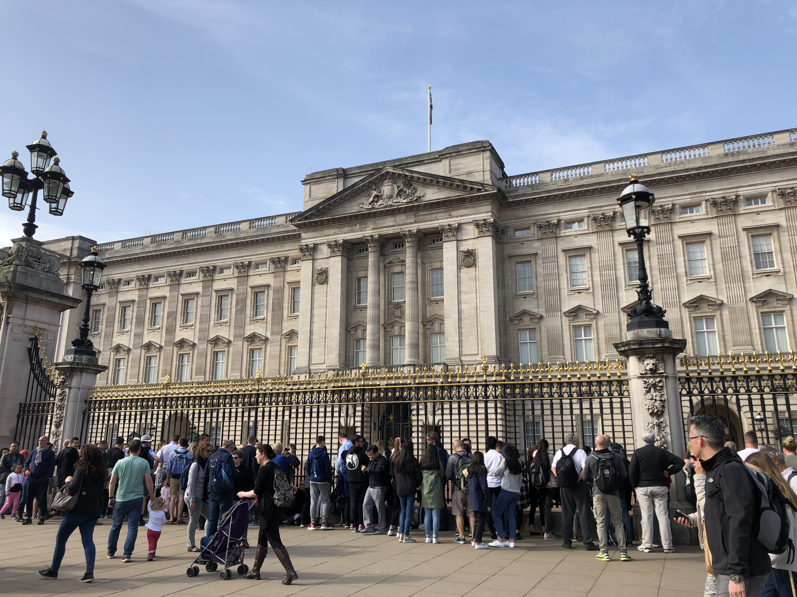
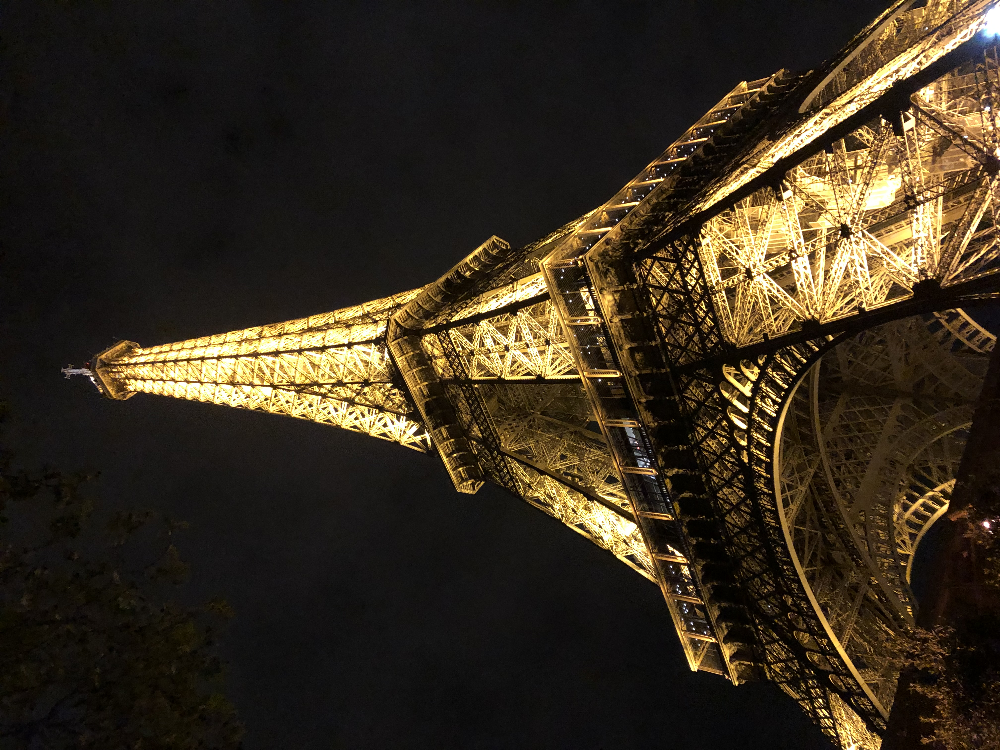

<html>

<head>
<title> Travel Blog with Alex </title>

</head>

<h1> Travel Blog with Alex </h1>

<h2> Trip #1: Hawaii </h2>

 The moment my plane touched down on the runway of Daniel K. Inouye International Airport, the spirit of aloha enveloped me. The gentle breeze, warm smiles, and fragrant leis offered by welcoming locals signaled the start of my Hawaiian adventure.  

<b>Waikiki Beach: A Postcard in Reality</b>  

No trip to Honolulu is complete without a visit to the iconic Waikiki Beach. As I strolled along the pristine shoreline, I marveled at the Diamond Head Crater, a picturesque backdrop to the glistening turquoise waters. It felt like I was walking inside a postcard, surrounded by surfers catching the perfect wave and sunbathers enjoying the tropical sun.  

<b>Historical Adventures: Pearl Harbor</b>  

Honolulu is not just about natural beauty; it's also a place with a rich history. I visited Pearl Harbor, a sobering and poignant experience. Standing at the USS Arizona Memorial, I paid my respects to the brave servicemen and women who lost their lives during the infamous attack in 1941. It was a humbling reminder of the sacrifices made for freedom.  

<b>Culinary Delights: A Taste of Hawaii</b>  

Hawaii's unique culinary scene is a fusion of cultures, with influences from Japan, China, the Philippines, and more. I couldn't resist trying some authentic Hawaiian dishes like poke (raw fish salad), loco moco (a hearty meal of rice, burger patty, fried egg, and gravy), and the delectable malasadas (Portuguese doughnuts). Each bite was a burst of tropical flavors that left me craving for more.  

<b>Hiking to Heaven: Diamond Head State Monument</b>  

My adventure-seeking side led me to hike up the Diamond Head State Monument. The trail offered panoramic views of the city and the Pacific Ocean, a reward well worth the challenging climb. The sight of the island's lush landscape from the summit was breathtaking, and it's an experience I'll never forget.  

<b>Sunset Magic: Haleiwa Beach Park</b>  

For a perfect end to my days, I would head to Haleiwa Beach Park on Oahu's North Shore to witness the mesmerizing Hawaiian sunsets. As the sun dipped below the horizon, it painted the sky with hues of orange, pink, and purple. It was an ethereal experience that left me feeling both humbled and connected to the beauty of nature.  

<b>Conclusion: A Piece of My Heart in Honolulu</b>  

My trip to Honolulu, Hawaii, was more than just a vacation; it was a transformative experience. Honolulu offered a captivating blend of natural beauty, history, culture, and unforgettable moments. I left the island with a piece of my heart and a promise to return someday to explore even more of this paradise on Earth. Aloha, Hawaii – until we meet again! 
  

<h2> Trip #2: London, England </h2>

 London, the bustling and historic capital of the United Kingdom, has always held a special place on my travel bucket list. Finally, the stars aligned, and I embarked on a journey that would introduce me to the vibrant tapestry of this iconic city. Here's a glimpse into my unforgettable trip to London. 

<b>A Royal Welcome: Buckingham Palace and The Changing of the Guard</b> 

London welcomed me with open arms, and I began my adventure with a visit to Buckingham Palace, the official residence of the British monarch. The Changing of the Guard ceremony was a majestic display of British pomp and tradition that left me in awe. The palace's regal façade and lush gardens were a sight to behold. 

<b>The Tower of London: History at Every Corner</b> 

Stepping into the historic Tower of London was like traveling back in time. The White Tower, the oldest part of the complex, housed an impressive display of medieval weaponry and armor. As I explored the grounds, I couldn't help but be captivated by tales of royal intrigue, imprisonment, and the legendary Crown Jewels. 

<b>Iconic Landmarks: Big Ben, London Eye, and Westminster Abbey</b> 

No visit to London is complete without seeing the iconic Big Ben and the London Eye. As I crossed the Westminster Bridge, the view of these majestic landmarks against the backdrop of the River Thames was an unforgettable moment. I also explored the awe-inspiring Westminster Abbey, where the architecture and history came together in a harmonious blend. 

<b>Cultural Marvels: The British Museum and Tate Modern</b> 

Art and history enthusiasts will find solace in London's world-renowned museums. The British Museum's vast collection of artifacts from around the world was a journey through human history. At the Tate Modern, I immersed myself in contemporary art, marveling at the creativity on display. 

<b>Culinary Delights: From Fish and Chips to Afternoon Tea</b> 

Exploring London's culinary scene was a delightful adventure. I couldn't resist trying classic British dishes like fish and chips in a traditional pub. For a quintessentially British experience, I indulged in afternoon tea at a charming tea room, savoring delicate sandwiches, scones, and a variety of teas. 

<b>A Walk in the Parks: Hyde Park and Regent's Park</b> 

London's vast green spaces provided a serene escape from the city's hustle and bustle. Hyde Park and Regent's Park offered a respite in the heart of London. Whether strolling along the Serpentine or admiring the stunning roses in Queen Mary's Gardens, the parks were a breath of fresh air. 

<b>Conclusion: A Tale of Two Cities in One</b> 

My trip to London was a blend of history and modernity, tradition and innovation. The city's timeless charm, iconic landmarks, and warm-hearted people left a lasting impression. As I bid adieu to this captivating metropolis, I carried a piece of London in my heart, knowing that its allure will always beckon me to return and explore more of its hidden treasures. London, you have my heart. Until we meet again! 
 

<h2> Trip #3: Paris, France </h2>

 Paris, the city of love, has always held an undeniable allure for me. From the moment I set foot in the City of Light, I was swept away by its charm, elegance, and rich history. Here's a glimpse into my whirlwind adventure through Paris, a city that captured my heart.  

<b>Wandering the Champs-Élysées: An Iconic Start</b> 

My journey began on the world-famous Champs-Élysées, a street known for its luxury boutiques, cafes, and theaters. The bustling atmosphere and grandeur of the Arc de Triomphe at the western end set the stage for an incredible exploration of Paris. 

<b>Eiffel Tower: A Symbol of Romance</b> 

Of course, no visit to Paris would be complete without ascending the Eiffel Tower. The panoramic views from its observation decks were awe-inspiring, offering a breathtaking perspective of the entire city. The Iron Lady's sparkling lights at night added a touch of magic to my Parisian nights. 

<b>Louvre: Art and History Under One Roof</b> 

A visit to the Louvre was an art lover's dream come true. While the Mona Lisa was undoubtedly a highlight, the museum's vast collection left me in awe. I wandered through galleries filled with masterpieces, each piece telling a story of history and human creativity. 

<b>Strolling Along the Seine: A Quaint Retreat</b> 

Walking along the banks of the River Seine was a romantic experience. I crossed charming bridges, spotted iconic landmarks like Notre-Dame Cathedral, and enjoyed picnics in the riverside gardens. The Seine's picturesque views revealed the heart and soul of Paris. 

<b>Montmartre and Sacré-Cœur: A Bohemian Escape</b> 

Montmartre, with its artistic heritage, offered a taste of old-world Paris. I wandered through cobblestone streets, soaking in the bohemian atmosphere. The visit to the Sacré-Cœur Basilica, with its stunning white domes, provided a breathtaking panorama of the city below. 

<b>Café Culture: Sipping Café au Lait</b> 

Paris is renowned for its café culture, and I indulged in numerous café au lait breaks. People-watching from the sidewalk tables, I savored delicate pastries and observed the rhythmic pulse of Parisian life. 

<b>Indulging in French Cuisine: Croissants to Crème Brûlée</b> 

No trip to Paris is complete without savoring its delectable cuisine. From buttery croissants at a corner patisserie to gourmet dinners at quaint bistros, each meal was a culinary delight. Crème brûlée was a particular favorite, but every dish had a touch of French elegance. 

<b>Conclusion: An Ode to Paris</b> 

My journey through Paris was a poetic symphony of art, history, romance, and exquisite cuisine. The city's beauty, culture, and sophistication were a marvel to behold, and I left with a promise to return someday. Paris had cast its spell on me, and I knew I would forever cherish the memories made in this enchanting city. À bientôt, Paris! 
 

<h2> Trip #4: Taipei, Taiwan </h2> 

 Taipei, the bustling capital of Taiwan, is a city that marries rich history and modernity seamlessly. Exploring this vibrant metropolis was an adventure I'll forever cherish. Here's a glimpse into my enthralling journey through the heart of Taipei. 

<b>Temples and Tradition: A Glimpse into Taiwan's Heritage</b> 

My journey began with a visit to Longshan Temple, an enchanting Buddhist temple that's not just a place of worship but a window into Taiwan's rich cultural heritage. The air was filled with the scent of burning incense, and the intricate architecture transported me back in time. 

<b>Taipei 101: Skyscrapers Touching the Sky</b> 

The iconic Taipei 101, formerly the world's tallest building, was an architectural masterpiece that beckoned me to the top. The views from the observatory on the 89th floor were simply breathtaking, offering a panoramic view of the city's modern skyline against the backdrop of lush mountains. 

<b>Street Food Delights: Taipei's Culinary Scene</b> 

Taipei is a paradise for food lovers. Exploring the bustling night markets was an adventure in itself. From xiao long bao (soup dumplings) to stinky tofu and bubble tea, the street food scene was a sensory overload. Each bite was a delicious discovery. 

<b>Cultural Exploration: National Palace Museum</b> 

A visit to the National Palace Museum was a deep dive into Taiwan's history and art. The museum's collection of ancient Chinese artifacts and priceless treasures was a testament to the region's rich cultural legacy. The Jadeite Cabbage, a prized exhibit, was truly captivating. 

<b>Natural Escapes: Yangmingshan National Park</b> 

Venturing beyond the city, I explored the lush landscapes of Yangmingshan National Park. The hot springs, rolling hills, and vibrant flora were a welcome escape from the urban hustle. Hiking through the volcanic terrain was an adventure filled with breathtaking vistas. 

<b>Modern Tranquility: Daan Forest Park</b> 

In contrast to the bustling streets, Daan Forest Park offered a serene retreat in the heart of Taipei. I picnicked under the shade of lush trees, strolled around the serene pond, and watched locals practice tai chi—a perfect escape from the city's vibrant energy. 

<b>Conclusion: Taipei's Tapestry of Beauty and Culture</b> 

My journey through Taipei was a tapestry woven with threads of tradition, modernity, and natural splendor. The city's striking contrast between historic temples and towering skyscrapers, flavorful street food and cultural richness, created an unforgettable experience. As I bid farewell to this captivating city, I carried with me the warmth of its people and the memories of an incredible adventure. Taipei, you've left an indelible mark on my heart. Until we meet again! 
 

<h2> Trip #5: Leon, Mexico </h2> 

 Nestled in the heart of Guanajuato, Mexico, León is a vibrant city known for its rich culture, stunning architecture, and warm-hearted locals. My recent trip to this charming destination was a journey of discovery and adventure. Here's a glimpse into my unforgettable experiences in León, Mexico. 

<b>León's Zócalo: A Warm Welcome to the Heart of the City</b> 

My journey began in the city's historic Zócalo, the central square surrounded by colorful colonial buildings. The lively atmosphere, bustling markets, and street musicians immediately introduced me to the warm and welcoming spirit of León. Here, I had my first taste of traditional Mexican cuisine, with street vendors offering mouthwatering tacos and elotes. 

<b>Shopping Haven: The Leather Capital of Mexico</b> 

León is renowned as the leather capital of Mexico, and a visit to the city's leather markets was a shopper's paradise. From stylish boots to beautifully crafted leather goods, the markets were a treasure trove for leather enthusiasts. The opportunity to watch skilled craftsmen at work was a unique experience. 

<b>Cultural Gems: Temples and Historic Sites</b> 

Exploring the city's historic district, I discovered several ornate churches and temples that bore witness to León's rich history. The Basílica Catedral de León and the Templo Expiatorio del Sagrado Corazón were architectural marvels that left me in awe. Each step was a journey back in time. 

<b>San Felipe: A Pueblo Mágico Retreat</b> 

A short drive from León, San Felipe was a picturesque escape from the city's hustle. As one of Mexico's Pueblos Mágicos, this charming town captivated me with its serene atmosphere and well-preserved colonial architecture. The breathtaking landscapes of San Felipe offered endless opportunities for hiking and exploration. 

<b>Feria de León: A Carnival of Tradition</b> 

My visit coincided with the Feria de León, one of Mexico's most celebrated fairs. The lively event was a sensory delight, with colorful parades, lively music, and mouthwatering street food. It was a chance to immerse myself in the local culture and traditions. 

<b>Delicious Fare: From Street Tacos to Fine Dining</b> 

The culinary scene in León was a true highlight of my trip. From savoring delicious street tacos to enjoying gourmet meals at local restaurants, I was continuously treated to a culinary adventure. Traditional dishes like birria and carnitas were a must-try. 

<b>Conclusion: León's Enchanting Tapestry</b> 

My journey to León, Mexico, was a tapestry woven with threads of history, tradition, and contemporary flair. The city's warm and welcoming atmosphere, vibrant culture, and delicious cuisine left me with lasting memories. As I bid adieu to this enchanting destination, I knew that I had uncovered just a fraction of its hidden treasures. León, you've found a special place in my heart, and I look forward to returning to explore even more of your charm. ¡Hasta pronto, León! 
 
 

<h2> Future Trip: Prague </h2>

The trip will be TBD (probably happening in Spring Break of 2024 but maybe not

<h1> <em> Want to See More Travel Photos? </em> </h1>
<a href="gallery.html"><h2>Click here to see Alex's Travel Photos</h2></a>

</html>
